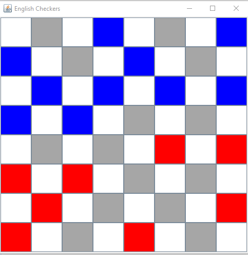
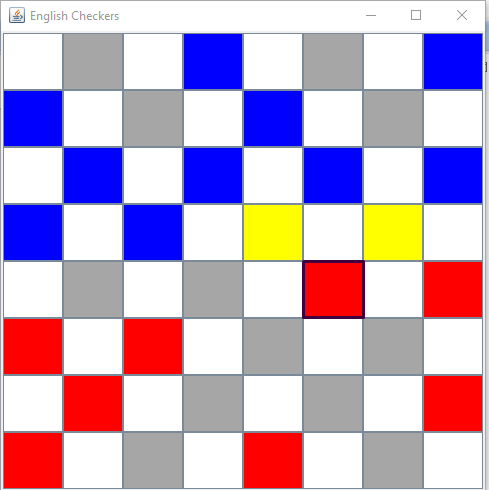

# EnglishCheckers:
Created the game English Checkers in Java using swing and awt libraries.

The game starts by choosing the game mode, PvP or PvE.

If PvE is choosen then you must choose the computer's strategy.

Evey turn, select the disc you want to move and possible tiles to move to will be marked as yellow, choose one of them.

## Structure

- EnglishCheckersGUI
  - Description: The graphic representation of the board, coloring and click event handling.
- EnglishCheckers
  - Description: The game logic.

## Future Possible Upgrades
- Add an intro and game over screens.
- Make smarter computer strategies.
- Change the graphic from coloring the tiles to rendering a checkers icons.

##  Images:

